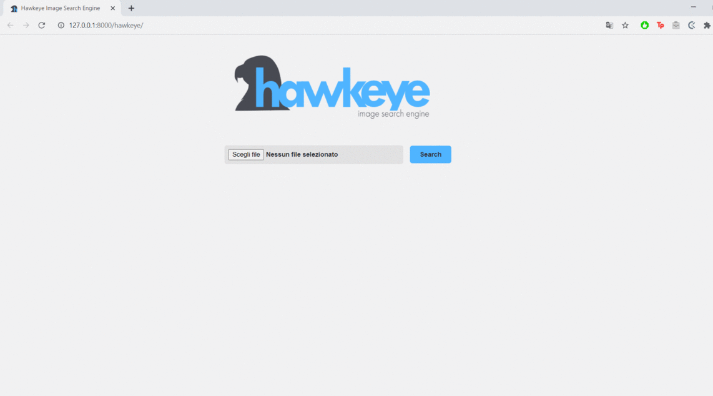

# Hawkeye: Image Search Engine - Web Interface

The web interface of Hawkeye had been developed with the use of the Django Framework, used to develop web application with Python.

## Usage Example

The user will load a query picture in the search bar and the server will reply with a list of similar images.

